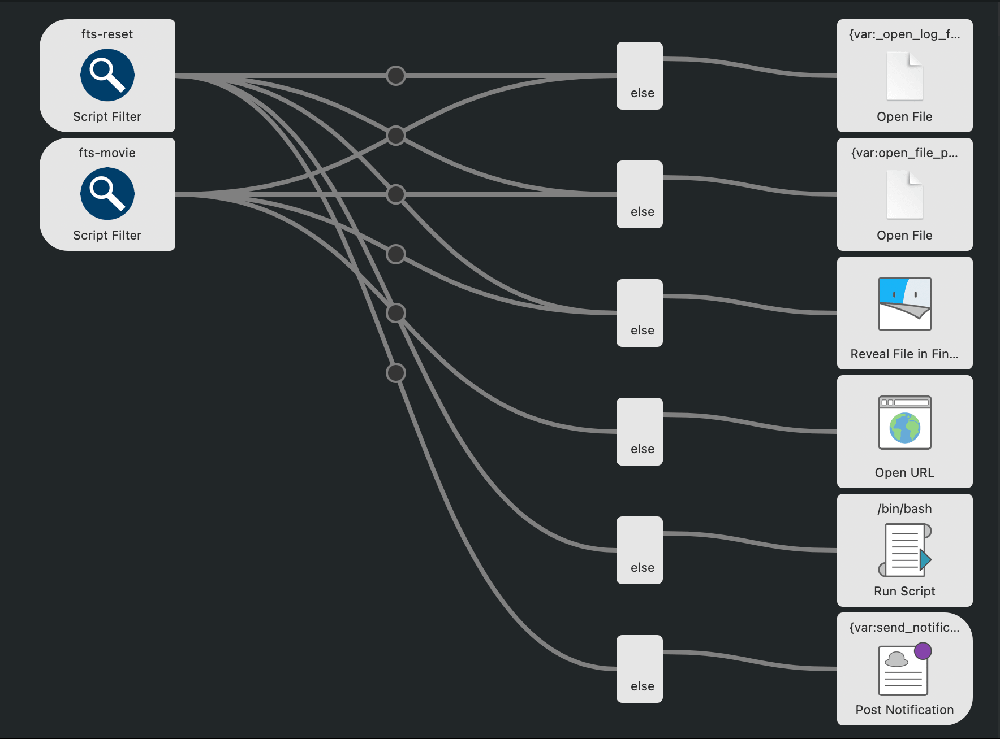
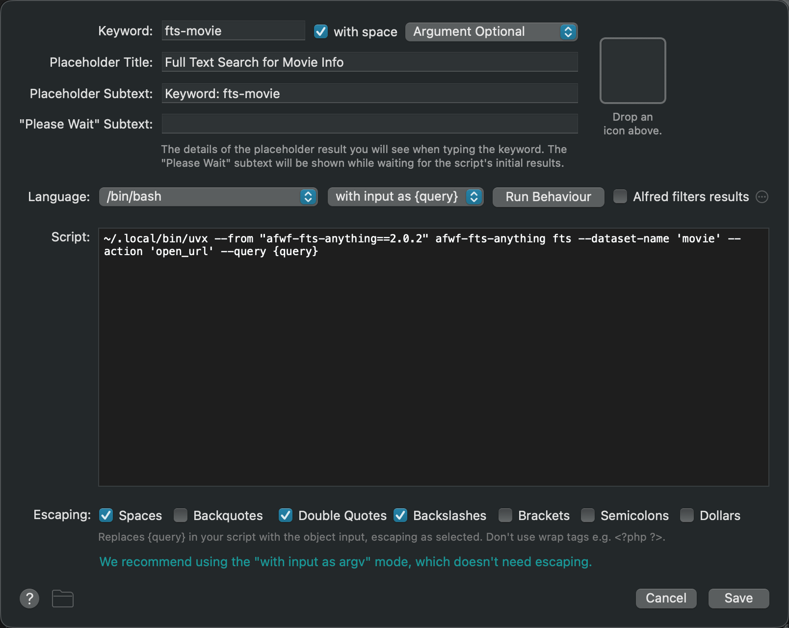

.. _Alfred-Workflow-Setup:

Alfred Workflow Setup
==============================================================================

Overview
------------------------------------------------------------------------------
``afwf_fts_anything`` has no UI of its own. Everything you see — the dropdown
list, icons, keyboard navigation, clipboard copy — is standard Alfred. Your
only job is to configure a **Script Filter** that calls the CLI via ``uvx``
and wire its output to Alfred actions.

A typical workflow looks like this:

The Script Filter runs the search and produces a list of items. Each item
carries an ``arg`` value (a URL or a file path). You connect the Script Filter
to one or more Alfred actions that consume that ``arg``.

Script Filter Configuration
------------------------------------------------------------------------------
Create a new blank workflow in Alfred Preferences → Workflows, add a
**Script Filter** object, and fill in the following fields:

.. list-table::
   :header-rows: 1
   :widths: 20 80

   * - Field
     - Value
   * - **Language**
     - ``/bin/bash``
   * - **Argument**
     - ``Optional`` (allows both empty and typed queries)
   * - **Script**
     - See templates below
   * - **Keyword**
     - Whatever trigger phrase you want (e.g. ``fts-movie``)

**Search script** (the main Script Filter):

.. code-block:: bash

    ~/.local/bin/uvx --from "afwf-fts-anything==2.0.1" afwf-fts-anything fts \
        --dataset-name 'movie' \
        --query '{query}' \
        --action open_url

Change ``--dataset-name`` to your dataset name, and ``--action`` to either
``open_url`` or ``open_file`` depending on what the result's ``arg`` contains.

Actions: open_url vs open_file
------------------------------------------------------------------------------
The ``--action`` flag tells the CLI what kind of value ``arg_field`` holds, so
Alfred can show the right context menu and behaviour.

**open_url** — ``arg_field`` is a URL. Wire the Script Filter to Alfred's
built-in **Open URL** action. Pressing ``Enter`` opens the URL in the default
browser. ``CMD+C`` copies it to the clipboard.

.. code-block:: bash

    --action open_url

Use this for: web documentation, IMDB pages, GitHub issues, AWS console
links, anything with an ``https://`` address.

----

**open_file** — ``arg_field`` is an absolute file path. Wire the Script
Filter to Alfred's **Open File** or **Reveal in Finder** action. Pressing
``Enter`` opens the file in its default application.

.. code-block:: bash

    --action open_file

Use this for: local notes, PDFs, project directories, any path on disk.

----

You can wire both actions in the same workflow — Alfred passes the ``arg`` to
whichever connection you configure:

Special Queries
------------------------------------------------------------------------------
Two query values have special behaviour regardless of the dataset:

.. list-table::
   :header-rows: 1
   :widths: 15 85

   * - Query
     - Behaviour
   * - *(empty)*
     - Returns **all documents** in the dataset, ordered by the ``sort``
       configuration in the setting file. Useful for browsing everything.
   * - ``?``
     - Opens the dataset folder in Finder and **reveals the setting file**.
       No search is performed. Handy for quick edits to ``{name}-setting.json``
       without leaving Alfred.

Rebuild Index Workflow
------------------------------------------------------------------------------
The search index is built once and reused. When you update ``{name}-data.json``
or pull fresh data from ``data_url``, you need to rebuild. Add a second
workflow for this.

**Option A — one dataset, manual trigger**

Add a **Keyword** object (no argument) connected to a **Run Script** object:

.. code-block:: bash

    ~/.local/bin/uvx --from "afwf-fts-anything==2.0.1" afwf-fts-anything rebuild-index \
        --dataset-name 'movie'

**Option B — list all datasets, pick one to rebuild**

Add a **Script Filter** connected to a **Run Script** object. The Script
Filter lists all datasets with fuzzy filtering:

.. code-block:: bash

    # Script Filter
    ~/.local/bin/uvx --from "afwf-fts-anything==2.0.1" afwf-fts-anything list-datasets-for-reset \
        --dataset-name-query '{query}'

Selecting a dataset from the list passes its name as ``arg`` to the Run
Script, which rebuilds it:

.. code-block:: bash

    # Run Script (receives dataset name as {query})
    ~/.local/bin/uvx --from "afwf-fts-anything==2.0.1" afwf-fts-anything rebuild-index \
        --dataset-name '{query}'

Upgrading the Pinned Version
------------------------------------------------------------------------------
The version number ``2.0.1`` is pinned in every Script field. To upgrade:

1. Find the new version on the
   `PyPI page <https://pypi.org/project/afwf-fts-anything/>`_ or
   `GitHub Releases <https://github.com/MacHu-GWU/afwf_fts_anything-project/releases>`_.
2. In Alfred Preferences, open each Script Filter in your workflow and
   replace ``2.0.1`` with the new version number.
3. ``uvx`` downloads the new version automatically on the next run. No other
   action is required.

If you have many workflows, a quick way is to open the workflow's
``*.alfredworkflow`` package and do a find-and-replace on the version string
inside the ``Script`` fields.
