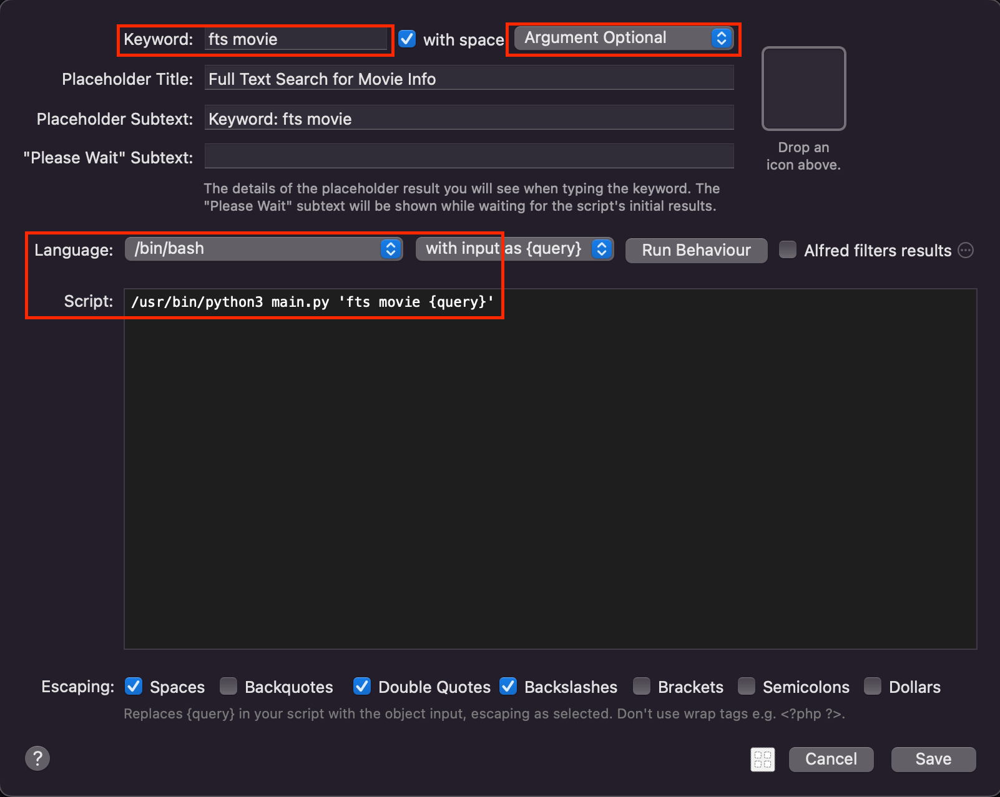

How it Works
==============================================================================

.. contents::
    :local:
    :depth: 1

Core Concept
------------------------------------------------------------------------------
**Setting file**

It is a JSON file the defines how you want your data been searched, and how to render the result in the Alfred drop down menu. We will explain the details later. You have to explicitly provide this file.

**Data file**

It is a JSON file that stores your searchable dataset. It has to be either explicitly provided, or it can be automatically downloaded from internet if the ``data_url`` is defined in the setting. It is an array of object. For example::

    [
        {
            "key1": "value1",
            "key2": "value2",
            ...
        },
        {
            "key1": "value1",
            "key2": "value2",
            ...
        },
        ...
    ]

**Index directory**

It is where the full-text search index is stored. The index will be automatically generated at the first time you search based on the data file and setting file. To reset the index, just delete the index directory.

**Icon directory**

It is an optional directory where you can put your ICON file to be used in the Alfred drop down menu. If the ICON is not defined, then Alfred Workflow icon will be used.

**afwf_fts_anything home directory**

It is a directory on your laptop that stores all your data files and setting files. It is at ``${HOME}/.alfred-afwf/afwf_fts_anything/``.

**Dataset**

It is an abstraction concept of your dataset. Each dataset has to have a name and ``afwf_fts_anything`` use the name to locate the data file and setting file. For example, if the dataset name is ``movie``, then:

- the setting file is at ``${HOME}/.alfred-afwf/afwf_fts_anything/movie-setting.json``.
- the data file is at ``${HOME}/.alfred-afwf/afwf_fts_anything/movie-data.json``.
- the index directory is at ``${HOME}/.alfred-afwf/afwf_fts_anything/movie-whoosh_index/``.
- the icon directory is at ``${HOME}/.alfred-afwf/afwf_fts_anything/icon/``.

Setting
------------------------------------------------------------------------------
Setting file defines how you want your data been searched, and how to render the result in the Alfred drop down menu.

**Define how you want to search**

Field is the basic unit of search. You can define how you want the data to be matched. Field has the following attributes:

:name <str>: the name of the field
:type_is_store <bool>: if True, the value is only stored but not indexed for search. Usually it can be used to dynamically construct value for argument (the action when you press enter), or for auto complete (the action when you press tab)
:type_is_ngram <bool>: if True, the value is index using ngram. It matches any character shorter than N characters. https://whoosh.readthedocs.io/en/latest/ngrams.html.
:type_is_phrase <bool>: if True, the value is indexed using phrase. Only case-insensitive phrase will be matched. See https://whoosh.readthedocs.io/en/latest/schema.html#built-in-field-types
:type_is_keyword <bool>: if True, the value is indexed using keyword. The keyword has to be exactly matched. See https://whoosh.readthedocs.io/en/latest/schema.html#built-in-field-types
:ngram_minsize <bool>: minimal number of character to match, default is 2.
:ngram_maxsize <bool>: maximum number of character to match, default is 10.
:keyword_lowercase <bool>: for keyword type field, is the match case-sensitive? default True (not sensitive).
:keyword_commas <bool>: is the delimiter of keyword is comma or space?
:weight <float>: the weight of the field for sorting in the search result. default is 1.0.
:is_sortable <bool>: is the field will be used for sorting? If True, the field has to be stored.
:is_sort_ascending <bool>: is the field will be used for sort ascending?

.. admonition:: BY THE WAY

    only one of ``type_is_ngram``, ``type_is_phrase``, ``type_is_keyword`` can be True.

**Define how you want to render the result**

In Alfred Workflow drop down menu, it will show list of items. Each item has five attributes:

- title: the title of the item, the font size is larger than subtitle.
- subtitle: the subtitle of the item, the font size is smaller than title.
- arg: it is the argument that will be passed to the next action when you press enter, you can use it to open a url, open a file, run a command, etc ... Also, it is the text you copied when you hit ``CMD + C``.
- autocomplete: it is the text that will be used for auto complete when you press ``Tab``.
- icon: it is the icon of the item, it can be absolute path to the icon image, or the relative path related to the ``Icon directory``.

.. image:: ./images/alfred-item.png

Example
------------------------------------------------------------------------------
Let's consider the IMDB Top 250 movies data set, the content of ``${HOME}/.alfred-afwf/afwf_fts_anything/movie-data.json`` is:

.. code-block:: javascript

    [
        {
            "movie_id": 1,
            "title": "The Shawshank Redemption",
            "description": "Two imprisoned men bond over a number of years, finding solace and eventual redemption through acts of common decency.",
            "genres": "Drama",
            "rating": 9.2
        },
        {
            "movie_id": 2,
            "title": "The Godfather",
            "description": "The aging patriarch of an organized crime dynasty transfers control of his clandestine empire to his reluctant son.",
            "genres": "Crime, Drama",
            "rating": 9.2
        },
        {
            "movie_id": 3,
            "title": "The Dark Knight",
            "description": "When the menace known as the Joker wreaks havoc and chaos on the people of Gotham, Batman must accept one of the greatest psychological and physical tests of his ability to fight injustice.",
            "genres": "Action, Crime, Drama",
            "rating": 9.0
        },
        {
            "movie_id": 4,
            "title": "12 Angry Men",
            "description": "The jury in a New York City murder trial is frustrated by a single member whose skeptical caution forces them to more carefully consider the evidence before jumping to a hasty verdict.",
            "genres": "Crime, Drama",
            "rating": 9.0
        },
        {
            "movie_id": 5,
            "title": "Schindler's List",
            "description": "In German-occupied Poland during World War II, industrialist Oskar Schindler gradually becomes concerned for his Jewish workforce after witnessing their persecution by the Nazis.",
            "genres": "Biography, Drama, History",
            "rating": 8.9
        },
        {
            "movie_id": 6,
            "title": "The Lord of the Rings: The Return of the King",
            "description": "Gandalf and Aragorn lead the World of Men against Sauron's army to draw his gaze from Frodo and Sam as they approach Mount Doom with the One Ring.",
            "genres": "Action, Adventure, Drama",
            "rating": 8.9
        },
        {
            "movie_id": 7,
            "title": "Pulp Fiction",
            "description": "The lives of two mob hitmen, a boxer, a gangster and his wife, and a pair of diner bandits intertwine in four tales of violence and redemption.",
            "genres": "Crime, Drama",
            "rating": 8.8
        },
        {
            "movie_id": 8,
            "title": "Fight Club",
            "description": "An insomniac office worker and a devil-may-care soap maker form an underground fight club that evolves into much more.",
            "genres": "Drama",
            "rating": 8.7
        },
        {
            "movie_id": 9,
            "title": "Saving Private Ryan",
            "description": "Following the Normandy Landings, a group of U.S. soldiers go behind enemy lines to retrieve a paratrooper whose brothers have been killed in action.",
            "genres": "Drama, War",
            "rating": 8.6
        }
    ]

And the search setting (content of ``${HOME}/.alfred-afwf/afwf_fts_anything/movie-setting.json``) is:

.. code-block:: javascript

    {
        // define how you want to search this dataset
        "fields": [
            {
                "name": "movie_id",
                "type_is_store": true
            },
            {
                "name": "title",
                "type_is_store": true,
                "type_is_ngram": true,
                "ngram_maxsize": 10,
                "ngram_minsize": 2,
                "weight": 2.0
            },
            {
                "name": "description",
                "type_is_store": true,
                "type_is_phrase": true
            },
            {
                "name": "genres",
                "type_is_store": true,
                "type_is_keyword": true,
                "keyword_lowercase": true,
                "weight": 1.5
            },
            {
                "name": "rating",
                "type_is_store": true,
                "type_is_numeric": true,
                "is_sortable": true,
                "is_sort_ascending": false
            }
        ],
        "title_field": "{title} ({genres}) rate {rating}", // title on Alfred drop down menu
        "subtitle_field": "{description}", // subtitle on Alfred drop down menu
        "arg_field": "{url}", // argument for other workflow component
        "autocomplete_field": "{title}", // tab auto complete behavior
        "icon_field": "movie-icon.png"

In the setting, we defined that:

- we only want to store ``movie_id``, it is not used in search. because we want to use ``CMD + C`` to copy the movie id.
- we want to use 2~10 gram to search title. For example, ``The Shawshank Redemption`` will be index as ``th``, ``he``, ``sh``, ``ha``, ``aw``, ..., ``the``, ``sha``, ``haw``, ... If you search ``aw``, this document will be matched. This is most user friendly but consume more disk.
- we want to use phrase to search description, in other word, the full word spelling has to be right. For example ``Two imprisoned men bond over a number of years, finding solace and eventual redemption through acts of common decency.`` will be index as ``two``, ``imprisoned``, ``men``, ``bond``, ... If you search ``two men``, this document will be matched. This is the most common search in full-text search in search engine.
- we want to use keyword to search genres. The query has to be exact match this field. For example, if you search ``drama``, then all ``drama`` movie will be matched.
- we want to use rating for sorting. if multiple documents are matched, the one with higher rating will be shown first.
- we want to use the string template ``{title} ({genres}) rate {rating}`` to construct the title.
- we want to use the string template ``{description}`` to construct the subtitle.
- we want to use the string template ``{url}`` to construct the arg.
- we want to use the string template ``{title}`` to construct the autocomplete.
- we want to use a custom icon image for search result.

.. image:: ./images/alfred-item.png

Alfred Workflow Configuration
------------------------------------------------------------------------------
Below is a sample workflow diagram. The left is the "Script Filter" definition, the right side has "Open File", "Reveal in Finder" and "Open Url".

.. note::

    The "Open File" and "Reveal in Finder" are `afwf Framework <https://afwf.readthedocs.io/index.html>`_ related components. Although the ``afwf_fts_anything`` is based on ``afwf Framework``, but they are not related to ``afwf_fts_anything``.

